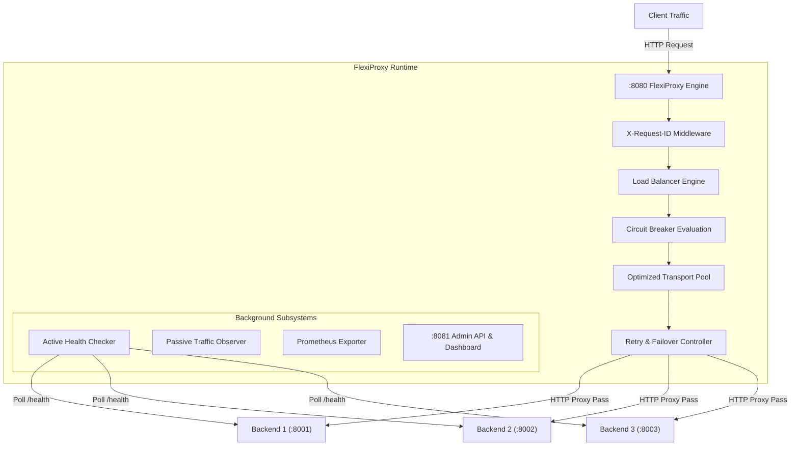

# FlexiProxy

**FlexiProxy: A High-Throughput Event-Driven Reverse Proxy with Dynamic Load Balancing, Health Monitoring, Failover, Circuit Breaking, Observability, and Resource-Aware Routing.**


---

## Overview

FlexiProxy is an open-source HTTP reverse proxy and load balancer built in Go. It sits between client applications and backend microservices, providing automated load distribution, active health probing, passive monitoring, circuit breaking, failover retries, Prometheus observability, and a real-time web dashboard.

## System Architecture



## Features

- **Real HTTP Reverse Proxy**: Preserves standard HTTP methods (`GET`, `POST`, `PUT`, `DELETE`, `PATCH`, `OPTIONS`, `HEAD`), query parameters, headers (`X-Forwarded-For`, `X-Forwarded-Proto`), and streaming responses without chunk buffering.
- **Dynamic Load Balancing**:
  - **Round Robin**: Sequential round-robin selection.
  - **Weighted Round Robin**: Smooth weighted round-robin distribution.
  - **Least Connections**: Prefers backends with the lowest active request concurrency.
  - **Adaptive Resource-Aware**: Dynamic scoring based on latency, active connections, CPU/Memory, and error rates.
- **Active Health Checking**: Background probing of `/health` endpoints with configurable thresholds.
- **Passive Health Monitoring**: Real-time traffic observation for 5xx errors and connection failures.
- **Circuit Breaking**: Concurrency-safe state transitions (`CLOSED`, `OPEN`, `HALF_OPEN`) per backend.
- **Safe Retry & Failover**: RFC 7231 compliant idempotent retries and failure rerouting.
- **Prometheus Observability**: `/metrics` endpoint exposing standard metrics.
- **Real-Time Observability Dashboard**: Built-in web UI powered by Server-Sent Events (SSE) and Chart.js on `:8081/dashboard/`.

---

## Quick Start

### Local Development

1. Build binaries:
   ```bash
   go build -o bin/flexiproxy ./cmd/flexiproxy
   go build -o bin/backend-demo ./cmd/backend-demo
   ```

2. Start a backend demo server:
   ```bash
   ./bin/backend-demo --port 8001 --id backend-1
   ```

3. Start FlexiProxy:
   ```bash
   ./bin/flexiproxy --config configs/flexiproxy.yaml
   ```

4. Send traffic through proxy:
   ```bash
   curl http://localhost:8080/api/test
   ```

5. Open Dashboard:
   [http://localhost:8081/dashboard/](http://localhost:8081/dashboard/)

---

### Docker Compose Deployment

```bash
docker-compose -f deployments/docker-compose.yml up --build
```

Access:
- **Proxy Port**: `http://localhost:8080`
- **Dashboard & Admin API**: `http://localhost:8081/dashboard/`
- **Prometheus Metrics**: `http://localhost:8081/metrics`

---

## Running Unit & Integration Tests

```bash
go test -v ./...
```

---

## License

FlexiProxy is open-source software licensed under the [Apache 2.0 License](LICENSE).
