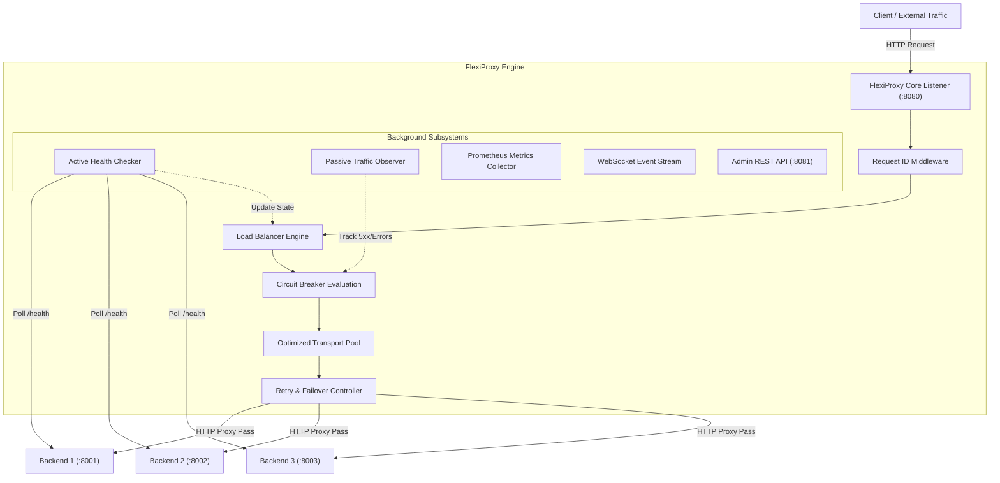

# FlexiProxy Architecture Overview

FlexiProxy is a high-throughput, event-driven HTTP reverse proxy and load balancer built in Go. It provides real-time traffic management, health monitoring, circuit breaking, passive observability, and adaptive resource-aware routing.

## Architecture Diagram

## Core Components

1. **HTTP Proxy Core**: Uses Go's `net/http/httputil.ReverseProxy` with customized transport connection pooling, context cancellation propagation, header injection (`X-Request-ID`), and streaming response preservation.
2. **Load Balancers**: Extensible `LoadBalancer` interface supporting:
   - **Round Robin**: Sequential distribution across healthy backends.
   - **Weighted Round Robin**: Proportional traffic distribution based on assigned backend weights.
   - **Least Connections**: Prefers backends with the lowest active request concurrency.
   - **Adaptive Resource-Aware**: Configurable heuristic scoring based on measured latency, active connections, CPU/Memory metrics, and recent error rates.
3. **Active Health Checker**: Periodically sends probe requests to `/health` endpoints and transitions backend health status based on configurable thresholds.
4. **Passive Health Monitor**: Monitors live user traffic status codes, transport errors, and latency to detect degraded backends between active checks.
5. **Circuit Breakers**: Concurrency-safe state machines (`CLOSED`, `OPEN`, `HALF_OPEN`) preventing cascading backend overload.
6. **Retry & Failover Unit**: Safe retry execution (idempotency checks for non-mutating methods or configured failure codes) with failover to alternate healthy backends.
7. **Observability Suite**: Prometheus `/metrics` endpoint, structured JSON logging (`slog`), and real-time WebSocket broadcast channel powering the admin dashboard.
